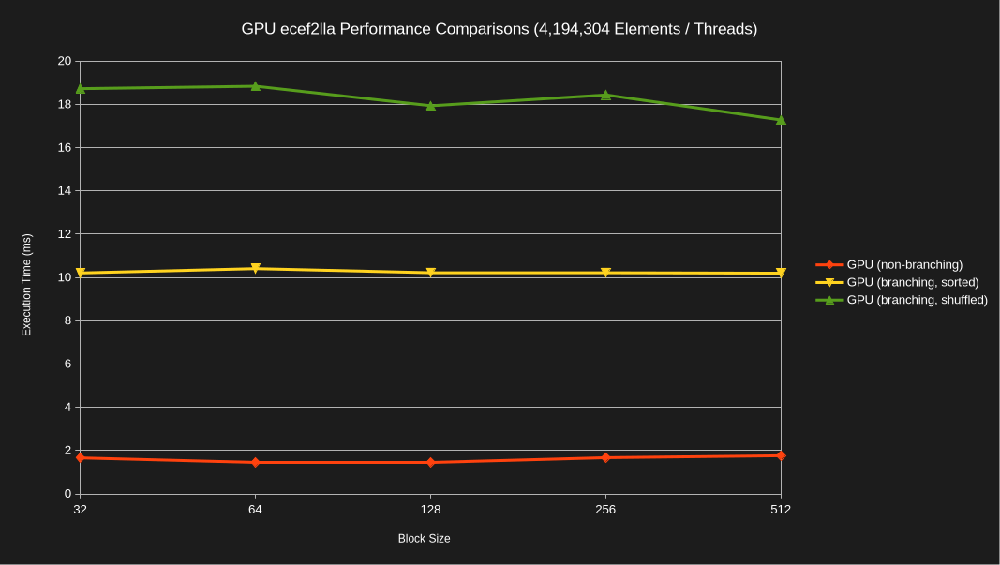
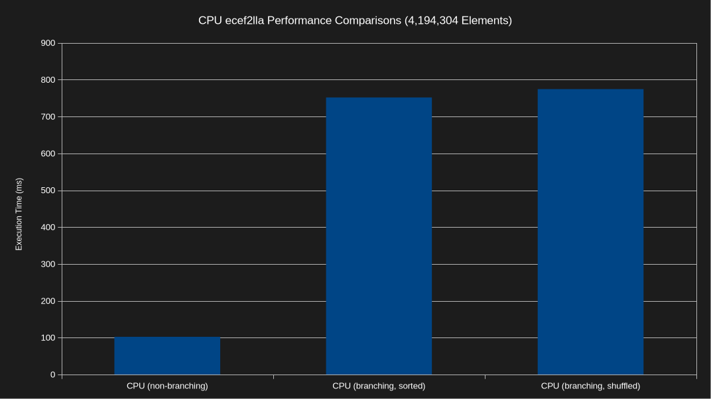
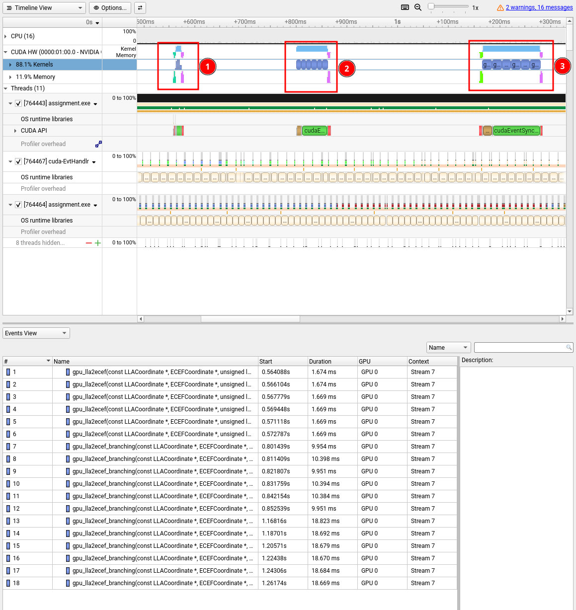

# Module 3 Assignment

The following directory contains the source code and answers to the assignment
questions for Module 3.

## Build and Run

The code is intended to be automatically built and run using the assignment
runner. This can be accomplished by executing the following command from the
root of the repository:

```bash
git clone https://github.com/mattgermano/EN605.617.git
cd EN605.617
./assignment_build_execution/run_assignments.sh
```

The above command requires Python 3,
[uv](https://docs.astral.sh/uv/getting-started/installation/), CMake, CUDA/NVCC,
and g++. These dependencies can be installed on Ubuntu 26.04 using the following
commands:

```bash
sudo apt update && sudo apt install -y wget build-essential cmake python3 git
wget https://developer.download.nvidia.com/compute/cuda/repos/ubuntu2604/x86_64/cuda-keyring_1.1-1_all.deb
sudo dpkg -i cuda-keyring_1.1-1_all.deb
sudo apt update
sudo apt install -y cuda-toolkit-13-4
wget -qO- https://astral.sh/uv/install.sh | sh
source $HOME/.local/bin/env
```

Also, ensure that `nvcc` is on your `PATH` via the following command:

```bash
export PATH="/usr/local/cuda/bin:$PATH"
```

The assignment runner executes the [`build.sh`](./build.sh) and
[`run.sh`](./run.sh) scripts to build and run the project with different
configurations.

Alternatively, the code can be manually built using the following commands:

```bash
cd module3
cmake -S . -B build -D CMAKE_BUILD_TYPE="Release"
cmake --build build --parallel $(nproc --ignore=1)
```

If CMake isn't available, you can also run a simple `make` command from this
directory:

```bash
make
```

It can then be run as follows:

```bash
./build/assignment.exe <total_threads> <block_size>

# ...for example
./build/assignment.exe 4194304 256
```

## Branching Performance Comparison

The following graph compares the CUDA kernel execution time (both non-branching
and branching) across different block sizes. The execution times do not include
the time to transfer the data to/from the CPU/GPU although it is important to
keep in mind. The test used 4,194,304 data elements and total threads. As
expected, the non-branching case executes the fastest since it does not need to
conditionally run any extra instructions. The branching results are split based
on whether the data was sorted or shuffled. In the sorted case, the input buffer
was an array of LLA coordinates where 50% of the coordinates were in the
northern hemisphere (i.e., latitude > 0) and 50% were in the southern hemisphere
(i.e., latitude < 0). The kernel branch is executed for all the coordinates that
have a latitude in the norther hemisphere. This results in a substantially
longer execution time since additional FP64 instructions must execute. However,
the data is sorted so all threads within in a warp either take the branch or
don't. Measuring the performance of the same branching kernel after shuffling
the data results in a nearly 2x performance degradation since a random number of
northern/southern hemisphere coordinates are mixed within a warp. This causes a
large warp divergance penalty. The execution time was largely consistent across
block sizes since the application was memory bound and the total number of
threads was still providing a high occupancy.



The following graph compares the CPU function execution time (both non-branching
and branching). As expected, the branching case takes much longer to execute due
to the additional instructions that must be executed. The shuffled version
likely takes slightly longer since the data is randomly mixed and harder to
branch predict.



I also profiled the application using Nsight Systems to view the results in a
different way (and also because I was having fun learning about the tool). The
image below shows a timeline for the kernel executions across the duration of
the application. The first block are the non-branching kernels executing six
times. The second block is the branching kernel executing on sorted data six
times. The third block is the branching kernel executing on shuffled data six
times. The event view table at the bottom shows the duration of each kernel
execution.



## Prior Submission Review

The following sections identify good and bad qualities of the code provided in
the assignment text.

### Bad Qualities

1. The host arrays (`int a[N], b[N], c[N];`) are allocated on the stack. On
   Linux, the default max stack size is typically 8 MB which will significantly
   limit the maximum value for `N`. It is common to test CUDA code with large
   datasets and this program will crash on startup if `N` is around 700,000 or
   greater. The buffers can be allocated on the heap instead using `std::vector`
   or by calling `cudaHostMalloc` which the CUDA programming guide recommends
   for data that will need to be transferred between the CPU and the GPU.

1. CUDA kernels are launched asynchronously and return immediately. The code is
   attempting to measure the execution time of the CUDA kernel, but it is
   actually measuring the time it takes to launch the kernel. A synchronization
   mechanism would have to be called (such as `cudaDeviceSynchronize`) prior to
   getting the stop time to wait for the kernel to finish executing.
   Alternatively, [CUDA
   events](https://docs.nvidia.com/cuda/cuda-programming-guide/02-basics/asynchronous-execution.html#timing-operations-in-cuda-streams)
   could be used to record start/stop events.

1. In addition to the prior timing issue, the [lazy
   loading](https://docs.nvidia.com/cuda/cuda-programming-guide/04-special-topics/lazy-loading.html#)
   behavior of CUDA modules will cause the first kernel execution to take longer
   which impacts timing measurements. The CUDA programming guide recommends
   doing a warmup execution of the kernel and preloading the kernel prior to
   measuring its execution time to avoid the loading penalty which can cause
   misleading timing results.

1. Depending on the value of `N`, assigning `i * i` to `b[i]` can overflow an
   integer.

1. There is no error checking on any of the CUDA runtime API function calls.
   Every API function returns a `cudaError_t` enumeration. On success, it is
   equal to `cudaSuccess`. Properly handling errors prevents the program from
   crashing or hidden issues from arising. This extends to checking the result
   of a kernel launch which can be done using `cudaGetLastError` since the
   kernel launch is asynchronous. The input handling also does not check for
   errors so invalid values for blocks and threads can be passed when executing
   the program.

### Good Qualities

1. The code properly frees device memory that was allocated with `cudaMalloc`.

2. The code follows the standard workflow of allocating device memory, copying
   CPU data to device memory, executing the kernel, and then copying the results
   back from the GPU to the CPU.
