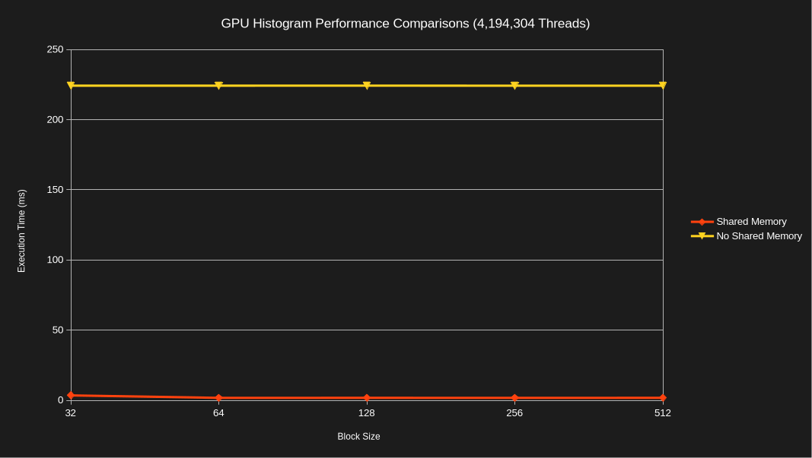
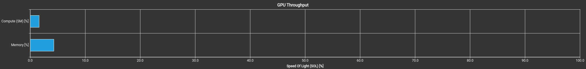
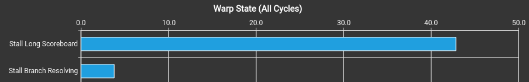
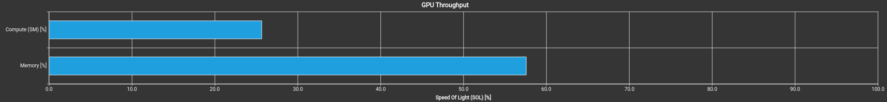

# Module 5 Assignment

The following directory contains the source code for Module 5. The source code
implements kernels to group 8-bit pixel values from an image into exposure bins
(blacks, shadows, midtones, highlights, and whites) using all CUDA memory types.
The following sections describe how each type of memory used as well as a
performance comparison between the kernels.

## Memory Usage

The assignment makes use of GPU global memory, host memory, shared memory,
constant memory, and registers. I primarily opted to use all memory types in a
single kernel (`gpu_histogram_shared_mem()`), but an additional kernel was
included that omits the usage of shared memory (`gpu_histogram_global_mem()`) to
compare performance. The following list describes how each type of memory was
used:

1. **Global Memory**: This memory is used to store the input image pixels and
   exposure bin histogram result on the device. The input image is stored as a
   1-D array of 8-bit pixel values. Each index in the global memory output array
   contains a counter representing the number of pixels within that exposure
   bin. This histogram is copied from the device to the host after the kernel
   executes.

1. **Host Memory**: This memory is used to store the input image pixels on the
   host. The input image is stored as a 1-D array of 8-bit pixel values. The
   pixels are copied to the global memory device array so the kernel can process
   the pixels on the device. There is also a host memory array for the exposure
   bin result so the output of the kernel can be copied back to host memory and
   validated for accuracy.

1. **Shared Memory**: This memory is used by the `gpu_histogram_shared_mem()`
   kernel to provide a high-speed working buffer for blocks to calculate
   intermediate exposure bin results. This prevents each thread in the grid from
   needing to increment one of a few counters in global memory. The exposure bin
   result is applied to the global memory output array only after each block has
   computed its entire result.

1. **Constant Memory**: This memory is used to store an exposure bin lookup
   table. The lookup table stores the exposure bin that each possible pixel
   value maps to. For example, a pixel value of 193 maps the pixel to the
   "Highlights" exposure bin. Both kernels use the constant memory lookup table
   to determine which bin each pixel value falls into.

1. **Registers**: This memory is used by each kernel to store intermediate
   results or values while the calculation is being performed. For example,
   registers are used to calculate the stride and thread index. Additionally,
   registers are used to store the current pixel value being processed as well
   as the exposure bin that pixel value falls into.

## Build and Run

The code is intended to be automatically built and run using the assignment
runner. This can be accomplished by executing the following commands:

```bash
git clone https://github.com/mattgermano/EN605.617.git
cd EN605.617
./assignment_build_execution/run_assignments.sh
```

The above command requires Python 3,
[uv](https://docs.astral.sh/uv/getting-started/installation/), CMake, CUDA/NVCC,
and g++. These dependencies can be installed on Ubuntu 26.04 using the following
commands:

```bash
sudo apt update && sudo apt install -y wget build-essential cmake python3 git
wget https://developer.download.nvidia.com/compute/cuda/repos/ubuntu2604/x86_64/cuda-keyring_1.1-1_all.deb
sudo dpkg -i cuda-keyring_1.1-1_all.deb
sudo apt update
sudo apt install -y cuda-toolkit-13-4
wget -qO- https://astral.sh/uv/install.sh | sh
source $HOME/.local/bin/env
```

Also, ensure that `nvcc` is on your `PATH` via the following command:

```bash
export PATH="/usr/local/cuda/bin:$PATH"
```

The assignment runner executes the [`build.sh`](./build.sh) and
[`run.sh`](./run.sh) scripts to build and run the project with different
configurations.

Alternatively, the code can be manually built using the following commands:

```bash
cd module5
cmake -S . -B build -D CMAKE_BUILD_TYPE="Release"
cmake --build build --parallel $(nproc --ignore=1)
```

If CMake isn't available, you can also run a simple `make` command from this
directory:

```bash
make
```

It can then be run as follows:

```bash
./build/assignment.exe <total_threads> <block_size>

# ...for example
./build/assignment.exe 4194304 256
```

## Performance Comparison

The following graph compares the CUDA kernel execution time for both kernels
across different block sizes with 4,194,304 total threads. The input image is
512,000,000 total pixels (32,000 x 16,000). Both kernels use global memory,
constant memory, and registers. The primary difference is that one uses shared
memory to calculate intermediate results before writing back to global memory
whereas the other exclusively writes to global memory.



The shared memory version of the kernel executes substantially faster than the
kernel that requires every thread to increment the same few counters in global
memory. The performance is also largely consistent across block sizes.

The kernel that exclusively used global memory became severely bottlenecked
since each thread was trying to call `atomicAdd()` to the same few memory
locations. The Warp Stall bar graph in Nsight Compute was useful for confirming
this behavior as it shows that the warp spent the majority of its time waiting
for the local/global (LG) memory instruction queue to not be full (Stall LG
throttle metric). The GPU speed of light metrics also showed that there was
extremely low memory throughput.




In contrast, the shared memory version of the kernel used shared memory to
compute a partial block-level result before combining that result with global
memory at the end. By having the threads within a block compute their results in
shared memory, there was substantially less memory contention since the
calculation computed by the entire block can be written to global memory instead
of each individual thread writing its own update. Shared memory is also much
faster than global memory so the threads could write updates in less time. The
Warp Stall graph for the shared memory kernel completely eliminates the global
memory write bottleneck and the majority of time is spent reading data from the
input array. For this particular example, the shared memory kernel executed
around 100x faster and had substantially higher compute/memory throughput.




